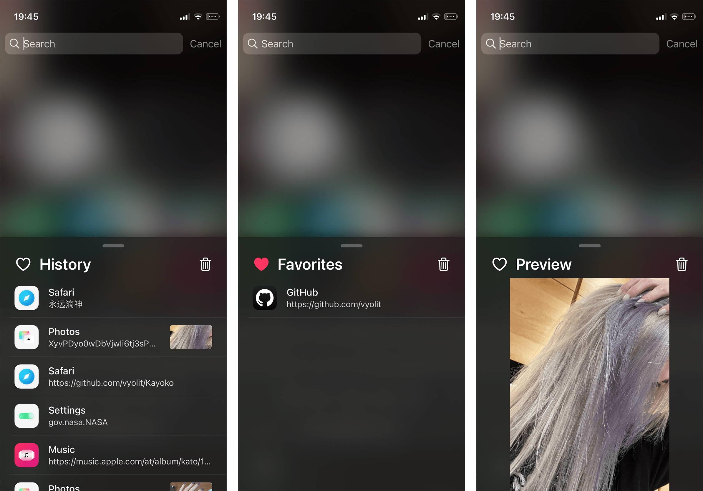

# Kayoko 4.3.2+free2

Feature-rich clipboard manager for iOS — **free build**.

Based on the archived GPLv3 Kayoko project by Alexandra Aurora Göttlicher, via the
maintained `com.82flex.kayoko` fork.

## What this build changes

### 1. Removed the "Purchase Kayoko" promo block

The preferences pane no longer shows the Havoc Marketplace purchase card or its
support footer at the bottom of the root list.

- `Preferences/Resources/Root.plist` — dropped the promo `PSGroupCell` footer and the
  `KayokoLinkCell` entry.
- `Preferences/Resources/{en,zh-Hans}.lproj/Root.strings` — removed the matching strings.

### 2. New switch: **Show App Icon and Time**

Added directly under the **Item Details** group.

When enabled, the capture time moves out of the detail line and is rendered
right-aligned on the same row as the item name, next to the app icon — a compact
two-line layout. The detail line then keeps only the size/length information.

Default: **off** — existing behaviour is unchanged until you turn it on.

Data flow:

| Layer | File | Change |
|---|---|---|
| Key | `Preferences/KayokoPreferenceKeys.h` | `ShowIconAndTime` + default `NO` |
| UI | `Preferences/Resources/Root.plist` | `PSSwitchCell` after Item Details |
| Runtime | `Tweak/Core/KayokoCoreRuntime.m` | default registration, read, push to view |
| Panel | `Tweak/Core/Controllers/KayokoMainViewController.{h,m}` | property + setter forwarding |
| List | `Tweak/Core/Controllers/KayokoHistoryListViewController.{h,m}` | forwarding |
| Table | `Tweak/Core/Views/KayokoHistoryListView.{h,m}` | property + reload |
| Content | `Tweak/Core/Models/KayokoTableViewCellContentProvider.{h,m}` | build the header timestamp |
| Cell | `Tweak/Core/Views/KayokoTableViewCell.{h,m}` | `timestampLabel`, layout, reuse id |
| L10n | `Preferences/Resources/{en,zh-Hans}.lproj/Root.strings` | new label text |

### 3. Authorization remnants cleaned up

The 4.3.2 base already disabled purchase verification; this build removes the
leftover dead code and user-visible strings.

- `Preferences/Controllers/KayokoRootListController.m` — deleted the authorization
  overlay and the Havoc credential-sync machinery.
- `Preferences/Controllers/KayokoAdvancedOptionsListController.m` and
  `AdvancedOptions.plist` — removed the **Deactivate** entry and its handlers.
- `Updater/main.m` — removed the `sync-credential` command and credential mirroring.
- `Shared/Purchases/` — module deleted; `Makefile` references removed.
- `Tweak/Core/KayokoCoreRuntime.m`, `Tweak/Core/Controllers/KayokoMainViewController.m`
  — the panel no longer consults an authorization gate.
- Localization files — dropped the "Purchase Kayoko", "Check Product Authorization",
  "Authorization Not Found", Sileo/Zebra instruction and network-failure strings.

### 4. Build fix: CRLF line endings

The tracked `devkit/*.sh` scripts, `Makefile`s, `control`, plists, `.strings` and
the CI workflow were stored with Windows CRLF line endings. On macOS/Linux bash
sources `devkit/*.sh`, and the trailing `\r` is then parsed as a command name:

```
devkit/env.sh: line 2:
: command not found
```

which aborts every variant with exit code `127`. All text build inputs are now
normalized to LF, and a `.gitattributes` (`* text=auto eol=lf`) prevents
regression on future checkouts.

## Preview



## Installation

1. Download the `deb` matching your jailbreak from the
   [releases](https://github.com/ab6866/Kayoko-free/releases).
2. Install it with your preferred package manager.

| Jailbreak | File |
|---|---|
| legacy (unc0ver, checkra1n, …) | `..._iphoneos-arm.deb` |
| rootless (Dopamine, palera1n) | `..._iphoneos-arm64.deb` |
| roothide Bootstrap | `..._iphoneos-arm64e.deb` |

Only install one variant. The package id `com.82flex.kayoko` is unchanged, so
uninstall the original Kayoko first — or simply install over it.

This package conflicts with and replaces the original `codes.aurora.kayoko` package.
During the v4 history upgrade, clipboard history from both the original
`codes.aurora.kayoko` data directory and the maintained `com.82flex.kayoko` data
directory is imported into the new store.

### Dependencies

`firmware (>= 14.0)`, `mobilesubstrate`, `preferenceloader`, `com.opa334.altlist`
(AltList repo: <https://opa334.github.io/>).

## Building

Three jailbreak variants are cross-built by GitHub Actions
(`.github/workflows/build.yml`, matrix: `legacy` / `rootless` / `roothide`).

```sh
gh workflow run "Build Package"
```

Or locally with a Theos checkout:

```sh
source devkit/rootless.sh     # or devkit/roothide.sh, devkit/env.sh
make package
```

Artifacts land in `packages/`.

| Variant | Env script | Package scheme |
|---|---|---|
| legacy | `devkit/env.sh` | *(none)* |
| rootless | `devkit/rootless.sh` | `rootless` |
| roothide | `devkit/roothide.sh` | `roothide` |

## Source Code

The archived upstream project is available at
<https://github.com/AlexandraAurora/Kayoko>.

## License

Kayoko is distributed under [GPLv3](COPYING). Paid distribution does not remove
recipients' GPLv3 rights to copy, modify, and redistribute the software.

This fork is not affiliated with or endorsed by the original author.
